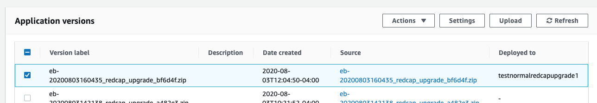
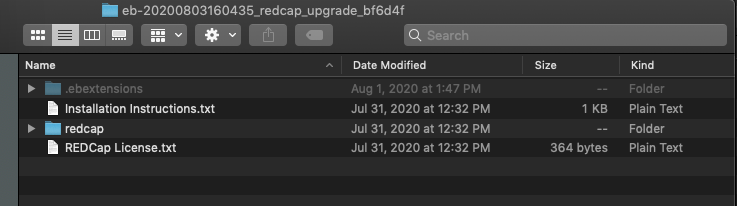
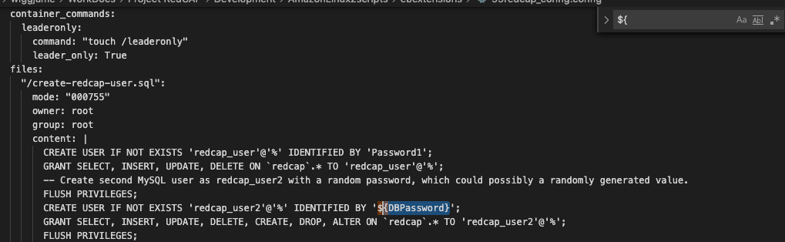
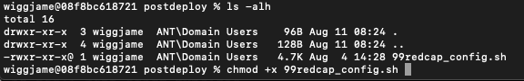
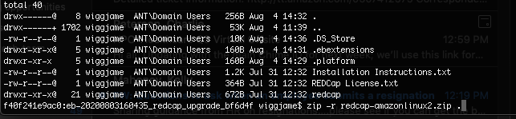
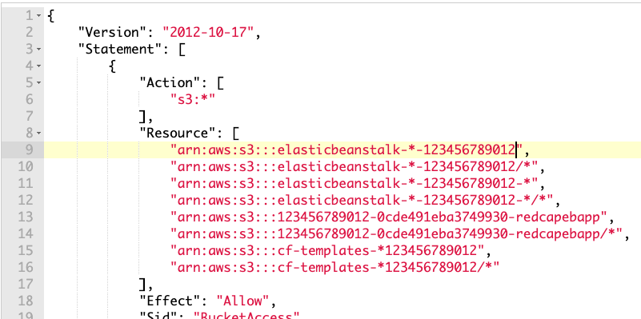
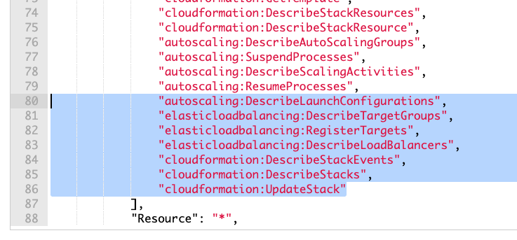

# REDCap upgrade to Amazon Linux 2 instructions

These instructions are for users of the REDCap on AWS automation that are currently running on the Amazon Linux 1 operating system.  
If you follow these instructions, it will result in a new Elastic Beanstalk environment running on Amazon Linux 2 that's connected to the 
same REDCap database as the Amazon Linux 1 environment.

These upgrade instructions are based on the general Amazon Linux 1 to Amazon Linux 2 upgrade instructions for Elastic Beanstalk [found in the documentation] 
(https://docs.aws.amazon.com/elasticbeanstalk/latest/dg/using-features.platform.upgrade.html#using-features.platform.upgrade.bluegreen).

## Step 1:  Download your existing Application Version from Elastic Beanstalk
Open the [Elastic Beanstalk console](https://console.aws.amazon.com/elasticbeanstalk) and **Choose your REDCap application**.  In the navigation pane, **choose Application Versions**.  Then select the zip file under the **Source** column of the currently deployed version.

## Step 2:  Extract this zip file

## Step 3:  Update these files with your environment's values
NOTE: the `.ebextensions/` and .`platform/` directories are hidden files in Linux/UNIX.  On a Mac, in order to see these directories in Finder, press Command-Shift-Period.

Download the files found in this directory of the Git repository and rename the directories `ebextensions/` and `platform/` to `.ebextensions/` and `.platform/`

In the file `.ebextensions/99redcap_config.config` and `.platform/hooks/postdeploy/99redcap_config.sh`:  replace `${...}` values with the equivalent values from your existing `.ebextensions/99redcap_config.config` file.  The original `.ebextensions/99redcap_config.config` file contains all of the values that you'll need for the other two new files.  In the Amazon Linux 2 version of this automation, the `99redcap_config.config` file's contents is split over these two files.

For the file`.ebextensions/00HIPAA.config`, just replace it with the `00HIPAA.config` file from this repository.

For the file `.platform/nginx/conf.d/https.conf`, just add it to your REDCap files without modification.

## Step 4: Make `99redcap_config.sh` executable
Using the command prompt, add the executable permission to the file `.platform/hooks/postdeploy/99redcap_config.sh` as shown below

## Step 5: Zip up your new REDCap application package
Create a new zip file that includes all of your original REDCap files with the new and modified files in the `.ebextensions/` and `.platform/` directories

## Step 6: Update the IAM Role permissions for your Elastic Beanstalk Instance Role
Look at your running EC2 instances for your current REDCap environment and select the IAM Role currently assigned to them.

Edit the `root` Permissions Policy JSON to add the additional permissions shown in the images below.

**You must replace the placeholder 123456789012 with your AWS accounnt number**

## Step 7: Create your new REDCap Elastic Beanstalk Application
7a. Go to the Elastic Beanstalk Management Console and create a new Application.

7b. Choose PHP and Amazon Linux 2 for your Platform.

7c. Upload your modified REDCap application zip file as your Source Code.

7d. Choose the **Configure More Options** button to proceed to further configuration screens.

7e. Choose the **Custom Configuration** Configuration Preset.

7f. Starting with **Capacity**, and then **Network**, copy all of the configuration from your existing Elastic Beanstalk REDCap environment.  **DO NOT change the AMI ID on the Capacity configuration though**.  Keep the new value.  Also, be sure that any Load Balancer health checks you add have a valid HTTP Code (like 200), even if the original configuration shows this as blank.

7g. Choose the *Create app* button to deploy your new REDCap environment on Amazon Linux 2

## Further Notes
This concludes the steps to create your new REDCap environment on Amazon Linux 2.  Please note that this environment has a different Elastic Beanstalk DNS name than your previous, so you will need to update and custom DNS CNAME records to point to this new environment.  After thoroughly testing, you can also delete your old Elastic Beanstalk environment. **HOWEVER, do not Terminate your original CloudFormation stack.** This stack still contains important resources, like your REDCap VPC and REDCap RDS database.

